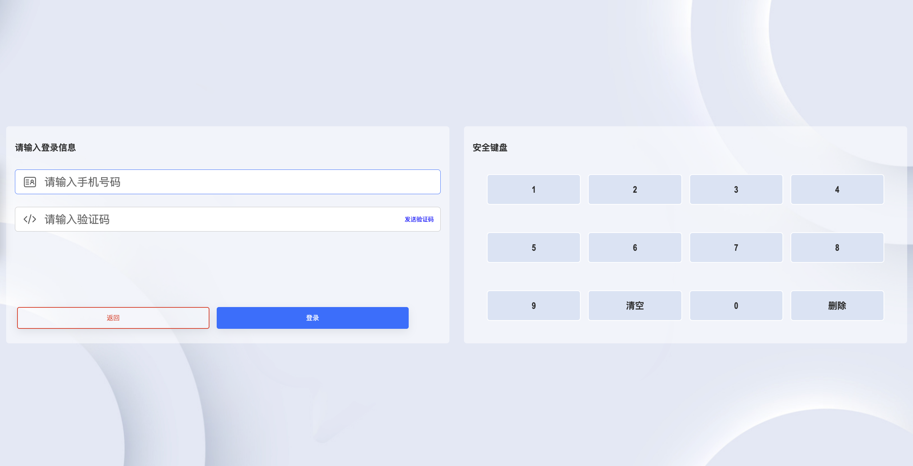
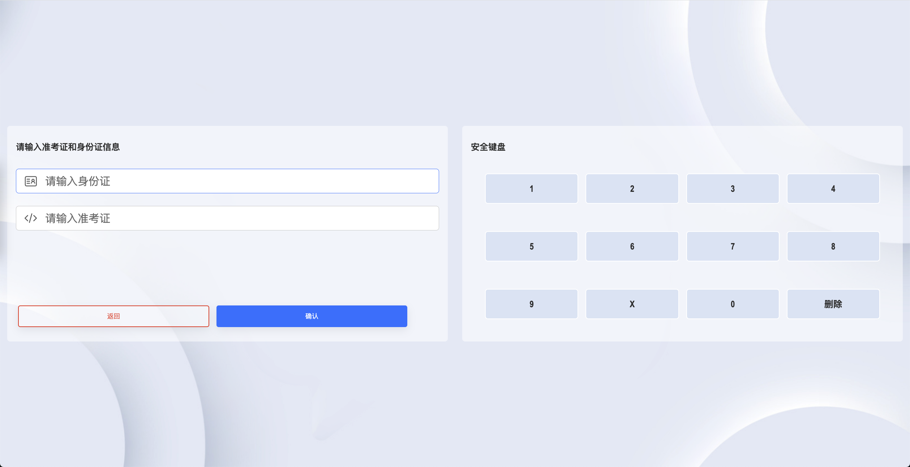
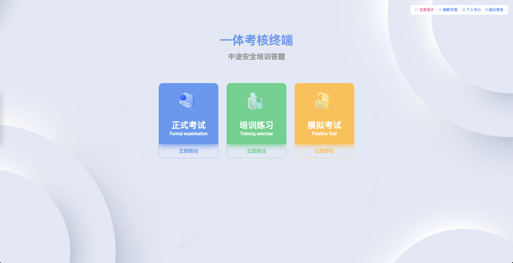
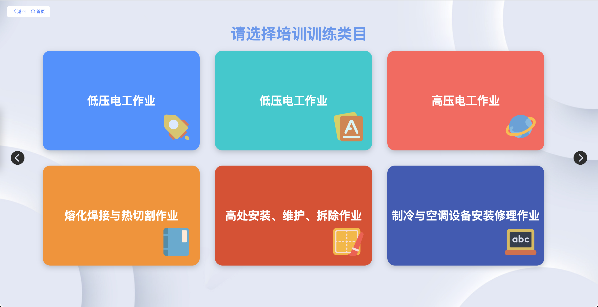
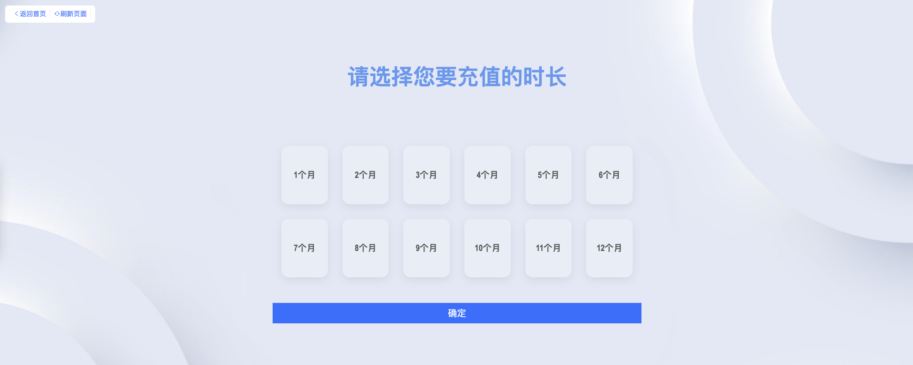
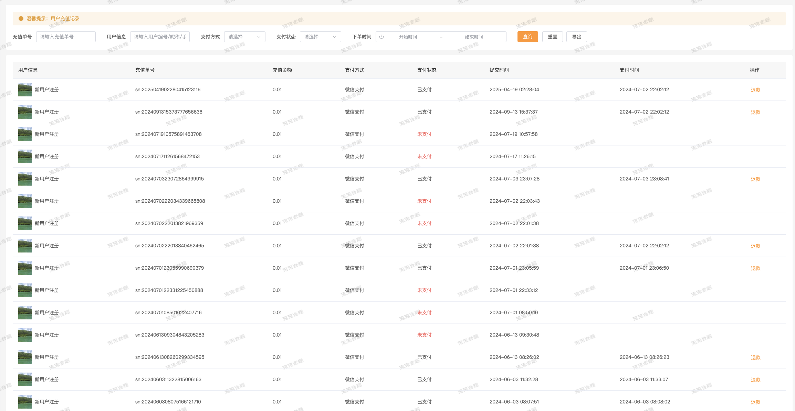
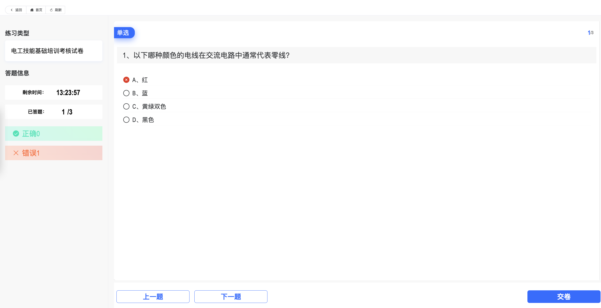
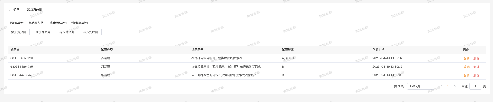
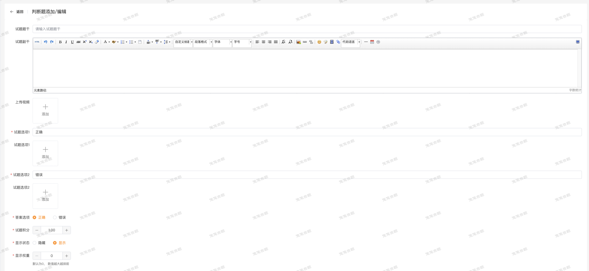

# PC答题系统介绍

## 系统愿景

传统的答题学习软件大多数是以APP、微信小程序为主，也有一些web端的答题软件。但是用于个人、中小型企业的轻量级答题系统，还是比较少的。基于该现状，我们特意推出云沐答题PC端。一款超级轻量的答题系统，支持常规的答题功能、支持用户认证功能、支持支付功能。

相关链接:

1、[Github](https://github.com/7small7/PC-)

2、[Gitee](https://gitee.com/bruce_qiq/webpage-pc-answering-system)

3、[官网以及联系方式](https://www.tutudati.com/doc/6.html)

## 功能介绍

### **一、核心功能亮点**  

#### **1. 极简登录+智能定位**  

- **3秒注册登录**：支持手机号+验证码一键登录，无需记忆密码。 

- **地区绑定**：用户首次登录自动定位/手动选择所在地区，**智能匹配当地考纲试题**（如北京高考试题、上海中考试题等）。

- **数据安全**：采用国密算法加密，确保用户隐私0泄露。  

#### **2. 多维学习模式**  

- **在线练习**：按知识点、难度分级练习（如“初中数学→几何→中等难度”），错题自动归档；  

- **模拟考试**：全真模拟考场环境，倒计时+自动交卷，支持考后生成成绩分析报告；  

- **AI推荐**：根据练习记录，智能推送薄弱环节强化试题。  

#### **3. 灵活变现体系**  

- 免费试卷：用于引流或基础服务（如“新人体验卷”）。 

- 付费试卷：定价自由设置（如9.9元/套或包月29元），支持按**时长购买**（1月/2月/3月等多种时长模式）。

- 支付闭环：集成微信/支付宝支付，交易流水实时可查。  

#### **4. 高效管理后台**  

- 权限分级：超级管理员→学科组长→普通教师，操作权限精细控制。

- 支持Excel/手动批量导入试题（含图片、公式）。

- 多级分类（学科→章节→知识点），一键拖拽调整结构。 

- 数据看板：实时监控试卷购买量、用户活跃度、营收趋势。

## 技术说明

### 后端技术

- 后端采用PHP + ThinkPHP框架开发，支持多环境配置。

- 数据库采用MySQL，支持MySQL5.7及以上版本，提供数据持久化存储服务；使用Redis作为数据缓存和一些中间件服务。

- NGINX作为服务器，提供高可用、负载均衡、SSL加密等安全功能。

### 前端技术

- 前端采用Vue + Vuex + Vue-router + Axios + Element-ui + Vue-cli3开发，支持SPA单页面应用。

- 管理端采用Vue + Vuex + Vue-router + Axios + Element-ui + Vue-cli3开发，搭建管理端功能界面。

## 联系我们

如果我们这套答题系统正适合你的业务场景，欢迎联系我们。我们的微信联系方式: `wx_06282`，请备注来意。
